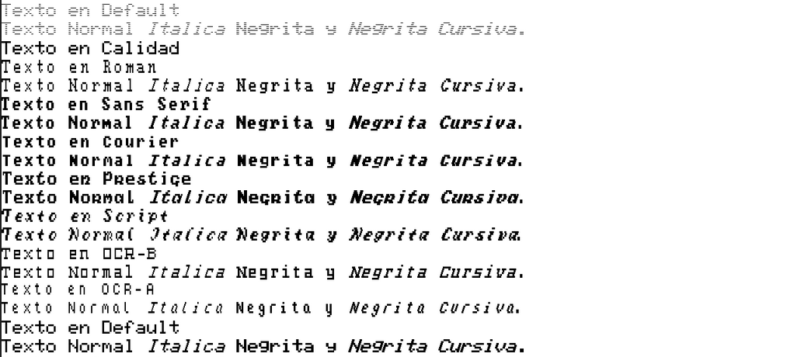

# ESP32 Printer Emulator
for computers with serial RS232 port.

This project is based on the hardware of fujinet-rs232
check the #defines at esp32printer.ino for the pinouts.

It provide a secondary serial port, including hardware handshake that emulate
a needle's colour printer type epson, as it accept a subset of the esc/p escape sequences.

it generate a .bmp for each A4 size sheet printed.

It's also provide a web server, so can be reached by wifi and printed in a moderm printer using a modern computer and webbrowser.

Still in development, only basic work.

by default is configured for a Sinclair QL Computer, 2400 bauds, 8N1 with Automatic CR on each LF configured.

## Actual Status
This is a example of supported features:

 
